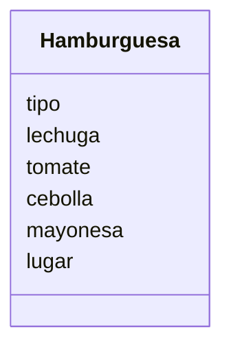

Un restaurante quiere ofrecer hamburguesas. Los clientes pueden elegir entre hamburguesa de: res, pollo o vegetariana.
Los clientes pueden agregar extras como: lechuga, tomate, cebolla y mayonesa. Ademas los clientes pueden decidir comer en el restaurante o llevar su pedido

### Análisis

Requisitos:
- Un restaurante ofrece hamburguesas
- Hay 3 tipos de hamburgesas de res, pollo y vegetariana
- Se puede agregar lechuga
- Se puede agregar tomate
- Se puede agregar cebolla 
- Se puede agregar mayonesa
- Se puede comer el pedido en el restaurante o llevarlo

Objetos:
- Hamburguesa

Características:
- Hamburguesa
    - tipo
    - lechuga
    - tomate
    - cebolla
    - mayonesa
    - lugar

Acciones:
- (No hay acciones)

# Diseño:
Clases:
- Hamburguesa:
    - Nombre: Hamburguesa
    - Atributos:
      - tipo
      - lechuga
      - tomate
      - cebolla
      - mayonesa
      - lugar
    - Métodos:
        - (No hay métodos)
