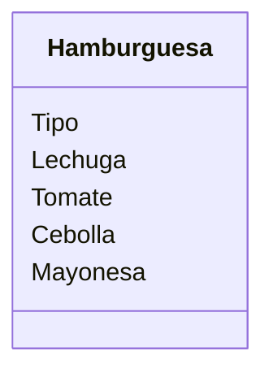

Un restaurante quiere ofrecer hamburguesas. Los clientes pueden elegir entre hamburguesa de: res, pollo o vegetariana.
Los clientes pueden agregar extras como: lechuga, tomate, cebolla y mayonesa. Ademas los clientes pueden decidir comer en el restaurante o llevar su pedido

### Requisitos:
- Hamburguesas de res, pollo o vegetariana.
- Agregar lechuga, tomate, cebolla y mayonesa
- Comer en el restaurante o llevar su pedido

### Objetos:
- Hamburguesa

### Características:
- Hamburguesa
    - Tipo
    - Lechuga
    - Tomate
    - Cebolla
    - Mayonesa

### Acciones:
- (No hay acciones)

# Diseño:
Clases:
- Hamburguesa:
    - Nombre: Hamburguesa
    - Atributos:
      - Tipo
      - Lechuga
      - Tomate
      - Cebolla
      - Mayonesa
      - Métodos:
        - (No hay métodos)
