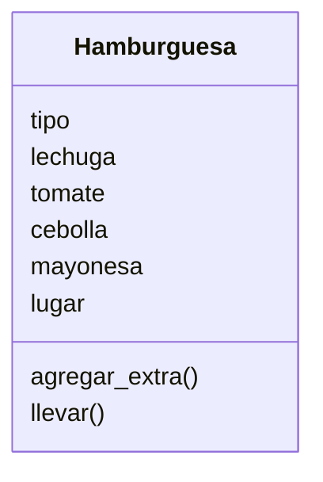

Un restaurante quiere ofrecer hamburguesas. Los clientes pueden elegir entre hamburguesa de: res, pollo o vegetariana.
Los clientes pueden agregar extras como: lechuga, tomate, cebolla y mayonesa. Ademas los clientes pueden decidir comer en el restaurante o llevar su pedido

### Análisis

Requisitos:
- Ofrecer hamburguesas de res, pollo o vegetariana.
- Permitir agregar extras como lechuga, tomate, cebolla y mayonesa.
- Permitir decidir comer en el restaurante o llevar el pedido.

Objetos:
- Hamburguesa

Características:
- Hamburguesa
  - tipo
  - lechuga
  - tomate
  - cebolla
  - mayonesa
  - lugar

Acciones:
- Hamburguesa
  - agregar_extra 
  - llevar
  
# Diseño:
Clases:
- Hamburguesa:
  - Nombre: Hamburguesa
  - Atributos:
    - tipo
    - lechuga
    - tomate
    - cebolla
    - mayonesa
    - lugar
  - Métodos:
      - agregar_extra 
      - llevar
