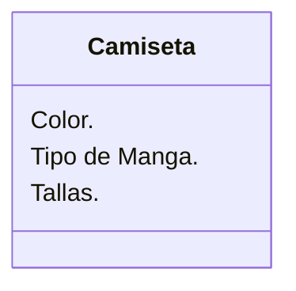
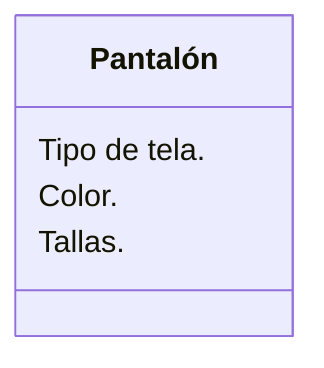

Una tienda de ropa quiere ofrecer camisetas y pantalones. Los clientes pueden elegir entre: camiseta de manga corta o larga y pantalón de mezclilla o tela
Las camisetas pueden ser de color rojo, azul o verde y los pantalones de color negro, gris o blanco.
Las camisetas tienen las tallas: S, M, L, XL
Los pantalones tienen las tallas desde la 32 hasta la 44

### Requisitos:
- Camisetas y pantalones.
- Camisetas de manga corta o larga.
- Camisetas de color rojo, azul o verde.
- Tallas camisas S, M, L, XL.
- Pantalón de mezclilla o tela.
- Pantalones de color negro, gris o blanco.
- Tallas pantalones desde la 32 hasta la 44

### Objetos:
- Camisetas.
- Pantalones.

### Características:
- Camisetas:
    - Color rojo, azul o verde.
    - Manga corta o larga.
    - Tallas camisas S, M, L, XL.
- Pantalones:
    - Mezclilla o tela.
    - Color negro, gris o blanco.
    - Tallas pantalones de la 32 a la 44.
  
### Acciones:
- (No hay acciones)

# Diseño:
Clases:
- Camiseta:
    - Nombre: Camiseta
    - Atributos:
      - Color.
      - Tipo de Manga.
      - Tallas.
    - Métodos:
        - (No hay métodos)

- Pantalón:
   - Nombre: Pantalón
    - Atributos:
      - Tipo de tela.
      - Color.
      - Tallas.
    - Métodos:
        - (No hay métodos)

