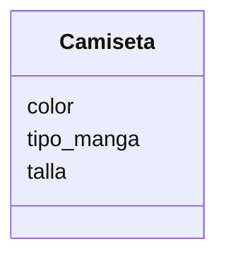

Una tienda de ropa quiere ofrecer camisetas y pantalones. Los clientes pueden elegir entre: camiseta de manga corta o larga y pantalón de mezclilla o tela
Las camisetas pueden ser de color rojo, azul o verde y los pantalones de color negro, gris o blanco.
Las camisetas tienen las tallas: S, M, L, XL
Los pantalones tienen las tallas desde la 32 hasta la 44

## Aálisis 
Requisitos:
- Ofrecer camisetas de manga corta o larga.
- Ofrecer pantalones de mezclilla o tela.
- Permitir seleccionar color de camisetas (rojo, azul, verde).
- Permitir seleccionar talla de camisetas (S, M, L, XL).
- Permitir seleccionar color de pantalones (negro, gris, blanco).
- Permitir seleccionar talla de pantalones (32 a 44).
  
Objetos:
- Camiseta
- Pantalon

Características:
- Camisetas:
    - color
    - tipo_manga
    - talla
- Pantalones:
    - tipo_tela
    - color
    - talla

Acciones:
- (No hay acciones)

# Diseño:

Clases:
- Camiseta:
    - Nombre: Camiseta
    - Atributos:
      - color
      - tipo_manga
      - talla
    - Métodos:
      - (No hay métodos)

- Pantalones:
   - Nombre: Pantalon
    - Atributos:
      - tipo_tela
      - color
      - talla
    - Métodos:
      - (No hay métodos)

