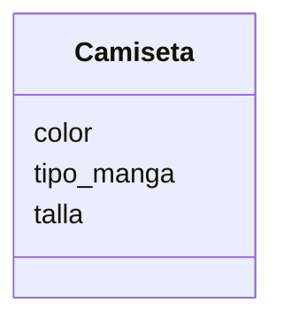
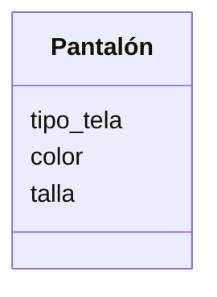

Una tienda de ropa quiere ofrecer camisetas y pantalones. Los clientes pueden elegir entre: camiseta de manga corta o larga y pantalón de mezclilla o tela
Las camisetas pueden ser de color rojo, azul o verde y los pantalones de color negro, gris o blanco.
Las camisetas tienen las tallas: S, M, L, XL
Los pantalones tienen las tallas desde la 32 hasta la 44

### Aálisis 
Requisitos:
- Una tienda ofrece camisetas y pantalones.
- Las camisetas pueden ser de manga corta o larga.
- Las camisetas pueden ser de color rojo, azul o verde.
- Las camisetas pueden ser de tallas S, M, L, XL.
- Los pantalones pueden ser de mezclilla o tela.
- Los pantalones pueden ser de color negro, gris o blanco.
- Los pantalones pueden ser de tallas desde la 32 hasta la 44

Objetos:
- Camisetas.
- Pantalones.

Características:
- Camisetas:
    - color
    - tipo_manga
    - talla
- Pantalones:
    - tipo_tela
    - color
    - talla

Acciones:
- (No hay acciones)

# Diseño:

Clases:
- Camiseta:
    - Nombre: Camiseta
    - Atributos:
      - color
      - tipo_manga
      - talla
    - Métodos:
        - (No hay métodos)

- Pantalón:
   - Nombre: Pantalon
    - Atributos:
      - tipo_tela
      - color
      - talla
    - Métodos:
        - (No hay métodos)

