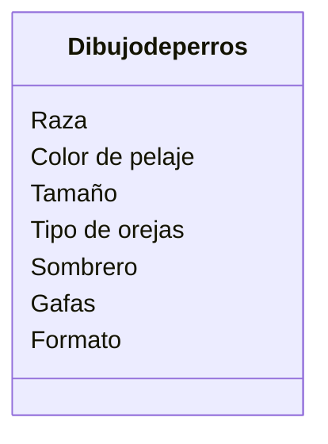

Estas diseñando una app para dibujar de perros con IA los usuarios pueden seleccionar características como la raza (por ejemplo, labrador o pastor alemán), el color del pelaje, el tamaño y el tipo de orejas.
Además, pueden agregar hasta dos accesorios, como sombreros o gafas.
El dibujo final puede descargarse en formato PNG o JPG.

### Requisitos:
- Dibujo de perros
- Raza
- Color de pelaje
- Tamaño
- Tipo de orejas
- Accesorios sombrero o gafas
- Formato

### Objetos:
- Dibujo de perros.

### Características:
- Dibujo de perros:
    - Raza
    - Color de pelaje
    - Tamaño
    - Tipo de orejas
    - Sombrero 
    - Gafas
    - Formato 
  
### Acciones:
- (No hay acciones)

# Diseño:
Clases:
- Dibujo de perros:
    - Nombre: Dibujo de perros
    - Atributos:
      - Raza
      - Color de pelaje
      - Tamaño
      - Tipo de orejas
      - Sombrero 
      - Gafas
      - Formato 
    - Métodos:
        - (No hay métodos)

