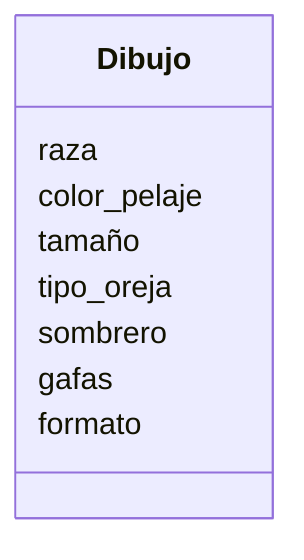

Estas diseñando una app para dibujar de perros con IA los usuarios pueden seleccionar características como la raza (por ejemplo, labrador o pastor alemán), el color del pelaje, el tamaño y el tipo de orejas.
Además, pueden agregar hasta dos accesorios, como sombreros o gafas.
El dibujo final puede descargarse en formato PNG o JPG.

### Análisis
Requisitos:
- Diseño de una app para dibujar perros con IA.
- Se puede seleccionar la raza.
- Se puede seleccionar el color de pelaje.
- Se puede seleccionar el tamaño.
- Se puede seleccionar el tipo de orejas.
- Se puede seleccionar los accesorios que son sombrero o gafas.
- Se puede seleccionar formato de descarga PNG o JPG.

Objetos:
- Dibujo.

Características:
- Dibujo:
    - raza
    - color_pelaje
    - tamaño
    - tipo_oreja
    - sombrero 
    - gafas
    - formato 
  
Acciones:
- (No hay acciones)

# Diseño:
Clases:
- Dibujo:
    - Nombre: Dibujo
    - Atributos:
      - raza
      - color_pelaje
      - tamaño
      - tipo_oreja
      - sombrero 
      - gafas
      - formato  
    - Métodos:
        - (No hay métodos)

