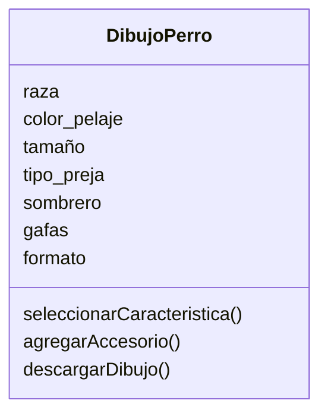

Estas diseñando una app para dibujar de perros con IA los usuarios pueden seleccionar características como la raza (por ejemplo, labrador o pastor alemán), el color del pelaje, el tamaño y el tipo de orejas.
Además, pueden agregar hasta dos accesorios, como sombreros o gafas.
El dibujo final puede descargarse en formato PNG o JPG.

### Análisis
Requisitos:
- Permitir la selección de características del perro (raza, color del pelaje, tamaño, tipo de orejas).
-  Permitir agregar hasta dos accesorios (sombreros o gafas).
-  Permitir descargar el dibujo final en formato PNG o JPG.

Objetos:
- DibujoPerro

Características:
- Dibujo:
    - raza
    - color_pelaje
    - tamaño
    - tipo_oreja
    - sombrero 
    - gafas
    - formato 
  
Acciones:
- DibujoPerro:
    - seleccionar_caracteristica
    - agregar_accesorio
    - descargar_dibujo 

# Diseño:
Clases:
- DibujoPerro:
    - Nombre: Dibujo
    - Atributos:
      - raza
      - color_pelaje
      - tamaño
      - tipo_oreja
      - sombrero 
      - gafas
      - formato   
    - Métodos:
      - seleccionar_caracteristica()
      - agregar_accesorio()
      - descargar_dibujo()

