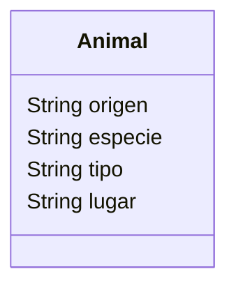

Un zoológico quiere llevar un registro de los animales que llegan a sus instalaciones.
Necesitan registrar su especie, tipo y lugar donde los encontraron.
Los animales del zoológico pueden ser mamíferos, reptiles o aves.
El origen de todos los animales es "feral". 
Este zoológico cuenta con 2 mamíferos, 1 reptil y 1 ave

- Realiza el análisis y diseño de la clase Animal
- Escribe el codigo en Python para crear la clase Animal
- Instancia los 4 animales con sus respectivos atributos

## Análisis
Requisitos:
- Registrar animales (especie, tipo, lugar donde los encontraron).
- Todos los animales son ferales.

Objetos:
- Animal
Características:
- Animal
    - origen
    - especie
    - tipo
    - lugar

Acciones:
- (No hay acciones)

## Diseño:
Clases:
- Animal:
  - Nombre: Animal
  - Atributos:
    - origen
    - especie
    - tipo
    - lugar
  - Métodos:
    - (No hay métodos)

