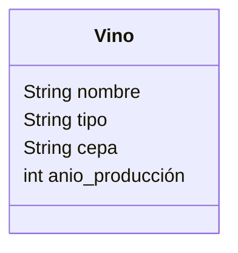
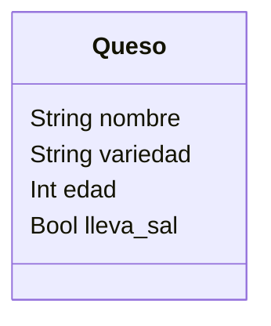

Una vinoteca quiere registrar los vinos y quesos que ofrecen.
De cada vino se necesita registrar su nombre, tipo, cepa y 
año de producción.
De cada queso se necesita registrar su nombre, variedad, 
edad y si lleva sal.
La vinoteca tiene en su inventario 4 vinos y 3 quesos 

- Realiza el análisis y diseño de las clases Vino y Queso
- Escribe el codigo en Python para crear la clases Vino y Queso
- Instancia los 4 vinos y 3 quesos con sus respectivos atributos

## Análisis
Requisitos:
- Registrar vinos por nombre, tipo, cepa y año de producción.
- Registrar quesos por nombre, variedad, edad y si lleva sal.

Objetos:
- Vino
- Queso
  
Características:
- Vino
  - nombre
  - tipo
  - cepa
  - anio_produccion
- Queso
  - nombre
  - variedad
  - edad
  - lleva_sal

Acciones:
- (No hay acciones)

## Diseño:
Clases:
- Vino:
  - Nombre: Vino
  - Atributos:
    - nombre
    - tipo
    - cepa
    - anio_produccion
  - Métodos:
    - (No hay métodos)

- Queso:
  - Nombre: Queso
  - Atributos:
    - nombre
    - variedad
    - edad
    - lleva_sal
  - Métodos:
    - (No hay métodos)

