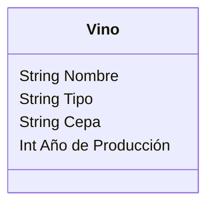
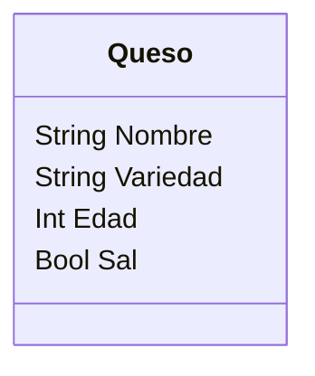

Una vinoteca quiere registrar los vinos y quesos que ofrecen.
De cada vino se necesita registrar su nombre, tipo, cepa y 
año de producción.
De cada queso se necesita registrar su nombre, variedad, 
edad y si lleva sal.
La vinoteca tiene en su inventario 4 vinos y 3 quesos 

- Realiza el análisis y diseño de las clases Vino y Queso
- Escribe el codigo en Python para crear la clases Vino y Queso
- Instancia los 4 vinos y 3 quesos con sus respectivos atributos

Requisitos:
- Registrar vinos.
- Registrar quesos.

Objetos:
- Vino
- Quesos
  
Características:
- Vino
    - Nombre
    - Tipo
    - Cepa
    - Año de producción
- Queso
    - Nombre
    - Variedad
    - Edad
    - Sal

Acciones:
- (No hay acciones)

