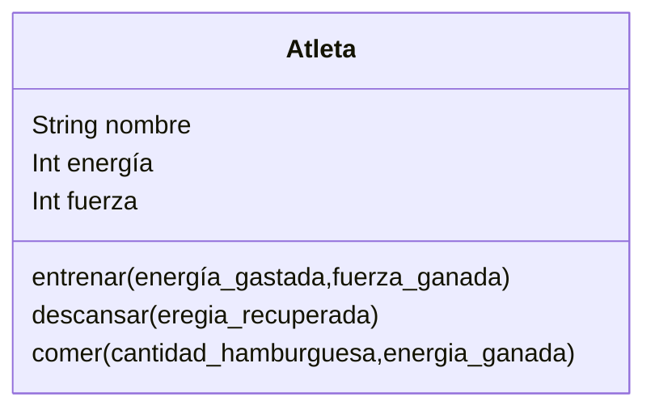

Imagina un juego de rol en el que el personaje principal es un atleta.
Este personaje tiene tres atributos principales:

nombre: identifica al atleta
energía: representa su nivel de energía actual.
fuerza: indica su capacidad física.
Cada atleta puede realizar las siguientes acciones:
Entrenar: aumenta su fuerza, pero consume energía.
Descansar: recupera energía.
Comer: solo puede consumir hamburguesas, lo que también le ayuda a recuperar energía.

## Análisis
Requisitos:
- El atleta debe tener un nombre, nivel de energía y fuerza.
- El atleta debe entrenar para aumentar su fuerza, consumiendo energía.
- El atleta debe descansar para recuperar energía.
- El atleta debe comer hamburguesas para recuperar energía.

Objetos:
- Atleta
  
Características:
- Atleta
    - nombre
    - energía
    - fuerza
    
Acciones:
- Atleta:
    - entrenar(energía_gastada)
    - descansar(eregia_recuperada)
    - comer(cantidad_hamburguesa, energia_ganada)

## Diseño:
Clases:
- Atleta:
  - Nombre: Atleta
  - Atributos:
    - nombre
    - energía
    - fuerza
  - Métodos:
    - entrenar(energía_gastada,fuerza_ganada)
    - descansar(eregia_recuperada)
    - comer(cantidad_hamburguesa, energia_ganada)
  

