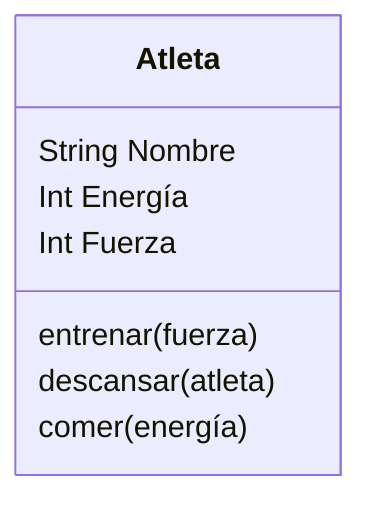

Imagina un juego de rol en el que el personaje principal es un atleta.
Este personaje tiene tres atributos principales:

nombre: identifica al atleta
energía: representa su nivel de energía actual.
fuerza: indica su capacidad física.
Cada atleta puede realizar las siguientes acciones:

Entrenar: aumenta su fuerza, pero consume energía.
Descansar: recupera energía.
Comer: solo puede consumir hamburguesas, lo que también le ayuda a recuperar energía.

Requisitos:
- Atleta tiene nombre.
- Un atleta tiene fuerza capacidad física
- Atleta entrena aumenta fuerza pero consume energía-
- Atleta descansa para recuperar energía
- Alteta come para recuperar energía

Objetos:
- Atleta
Características:
- Atleta
    - Nombre
    - Energía
    - Fuerza
    
Acciones:
- Atleta: Entrenar, Descansar, Comer.

