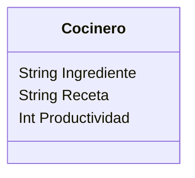

Imagina un sistema que modela el trabajo de cocineros en una cocina profesional.
Cada cocinero tiene tres elementos clave:

Una lista de ingredientes disponibles.
Un conjunto de recetas definidas que puede preparar
Un contador de productividad, que aumenta cada vez que prepara una receta con éxito. 
Si hay más de un cocinero, sus puntos individuales pueden sumarse para obtener una métrica agregada de productividad.

Las únicas recetas permitidas en el sistema son:

Receta	Ingredientes Requeridos
pan	harina, agua
pizza	harina, agua, sal, tomate, queso
galleta	harina, agua, sal, chocolate

Requisitos:
- Cocinero tiene lista de ingredientes.
- Cocinero tiene recetas.
- Cocinero tiene productividad.
- Cocinero si hay más cocineros los puntos individuales se pueden sumar.
- Receta pan, pizza, galleta

Objetos:
- Cocinero
Características:
- Cocinero
    - Lista de ingredientes
    - Recetas
    - Productividad
    
Acciones:
- Atleta: Cocina

