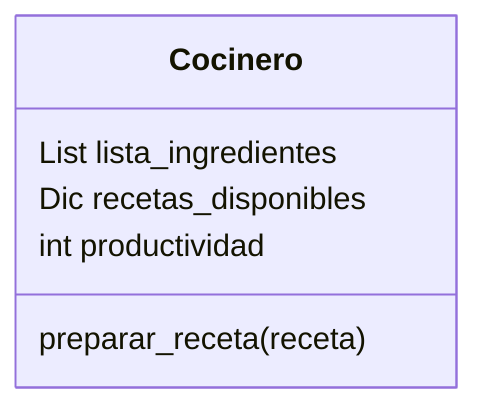

Imagina un sistema que modela el trabajo de cocineros en una cocina profesional.
Cada cocinero tiene tres elementos clave:
Una lista de ingredientes disponibles.
Un conjunto de recetas definidas que puede preparar
Un contador de productividad, que aumenta cada vez que prepara una receta con éxito. 
Si hay más de un cocinero, sus puntos individuales pueden sumarse para obtener una métrica agregada de productividad.

Las únicas recetas permitidas en el sistema son:
Receta	Ingredientes Requeridos
pan	harina, agua
pizza	harina, agua, sal, tomate, queso
galleta	harina, agua, sal, chocolate

## Análisis
Requisitos:
- Cada cocinero tiene lista de ingredientes, tiene recetas definidas, contador de productividad.
- Cuando hay más cocineros los puntos individuales de productividad se sumar.

Objetos:
- Cocinero
Características:
- Cocinero
    - lista_ingredientes
    - recetas_disponibles
    - productividad
    
Acciones:
- Atleta: 
    - preparar_receta(receta)

## Diseño:
Clases:
- Cocinero:
  - Nombre: Cocinero
  - Atributos:
    - lista_ingredientes
    - recetas_disponibles
    - productividad
  - Métodos:
    - preparar_receta(receta)

