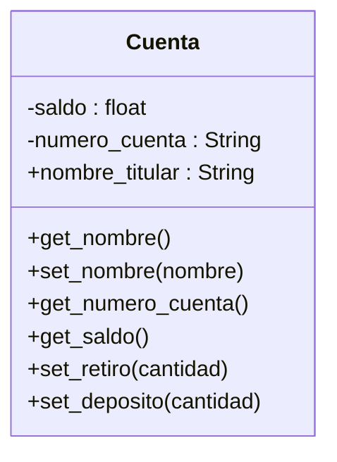

Un banco necesita desarrollar un módulo para gestionar cuentas bancarias. Cada cuenta tiene las siguientes caracteristicas:
saldo: Es un dato privado. Solo puede consultar. Se puede modificar únicamente a través de deposito y retiro
deposito: Permite ingresar dinero, incrementando el saldo.
retiro: Permite retirar dinero, siempre y cuando el saldo disponible sea suficiente.
número de cuenta: Es privado. Puede consultarse, pero no puede modificarse una vez asignado.
nombre del titular: Es público. Puede consultarse y modificarse libremente.

Requisitos:
- Gestionar cuentas bancarias.
- La cuenta tiene un saldo, deposito, retiro, número de cuentra, nombre del titular.
- El saldo se puede consultar, modificar con depósito o retiro y es privado.
- El depósito ingresa dinero e incrementa el saldo.
- Se puede realizar un retiro de dinero solo cuando hay el saldo disponible.
- El número de cuenta se puede consultar y es privado, no se puede modifcar.
- El nombre de titular se puede consultar y modificar, es público.

Objetos:
- Cuenta 
Características:
- Cuenta
    - nombre_títular
    - numero_cuenta
    - saldo
    
Acciones:
- Cuenta:
    - get_nombre()
    - set_nombre(nombre)
    - get_numero_cuenta()
    - get_saldo()
    - set_retiro(cantidad)
    - set_deposito(cantidad)

## Diseño:
Clases:
- Cuenta:
  - Nombre: Cuenta
  - Atributos:
    - nombre_títular
    - numero_cuenta
    - saldo
  - Métodos:
    - get_nombre()
    - set_nombre(nombre)
    - get_numero_cuenta()
    - get_saldo()
    - set_retiro(cantidad)
    - set_deposito(cantidad) 

