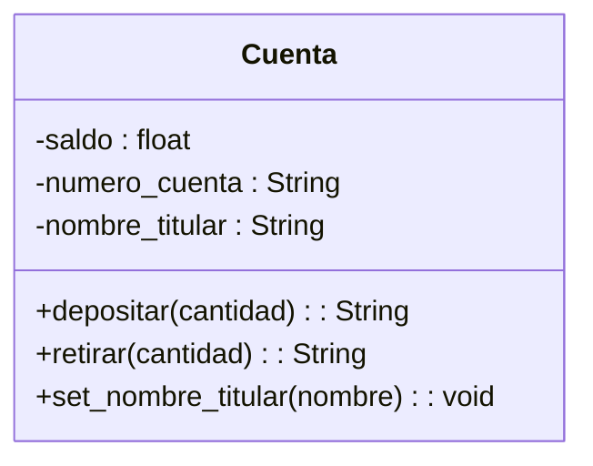

Un banco necesita desarrollar un módulo para gestionar cuentas bancarias. Cada cuenta tiene las siguientes caracteristicas:
saldo: Es un dato privado. Solo puede consultar. Se puede modificar únicamente a través de deposito y retiro
deposito: Permite ingresar dinero, incrementando el saldo.
retiro: Permite retirar dinero, siempre y cuando el saldo disponible sea suficiente.
número de cuenta: Es privado. Puede consultarse, pero no puede modificarse una vez asignado.
nombre del titular: Es público. Puede consultarse y modificarse libremente.

Requisitos:
- Un banco necesita gestionar cuentas bancarias.
- Cada cuenta tiene un saldo que es privado.
- Saldo se puede consultar.
- Saldo se modifica con un depósito o retiro.
- Depósito ingresa dinero e incrementa el saldo.
- Retiro de dinero, cuando hay saldo disponible.
- Número de cuenta privado Se consulta pero no se modifca.
- Nombre de titular es público se consulta y modifica.

Objetos:
- Cuenta bancaria
Características:
- Cuenta bancaria
    - Nombre del títular
    - Número de cuenta
    - Saldo
    - Depósito
    - Retiro
    
Acciones:
- Cuenta bancaria:
    - get_nombre()
    - set_nombre(nombre)
    - get_numero_cuenta()
    - get_saldo()
    - set_saldo(cantidad)
    - set_deposito(cantidad)
  

