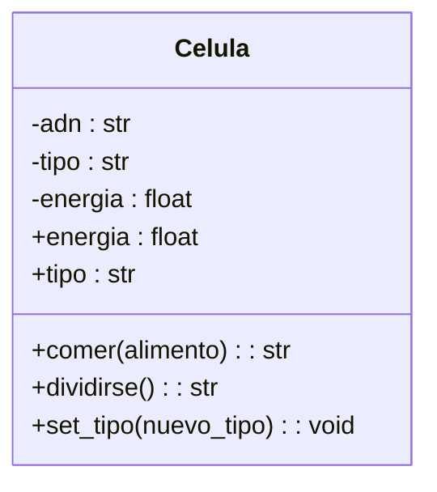

Un médico necesita simular el comportamiento de una célula. Cada célula debe cumplir con las siguientes características:
ADN: Se puede consultar pero no puede cambiar.
tipo de célula: Puede consultarse y modificarse libremente.
energía: Es un dato privado. Puede aumentar o disminuir, únicamente mediante las acciones de comer o dividirse.

Requisitos:
- Simular el comportamiento de una célula.
- ADN se consulta no cambia.
- Tipo de célula se consulta y modifica.
- Energía dato privado. 
- Energía puede aumentar o disminuir con comer y dividirse.

Objetos:
- Célula
Características:
- Célula
    - ADN
    - Tipo de célula
    - Energia
    
Acciones:
- Célula:
    - get_adn()
    - set_tipo(tipo)
    - get_tipo()
    - get_energia()
    - set_energia()
  

