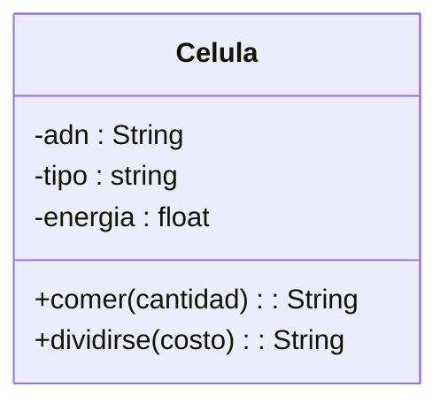

Un médico necesita simular el comportamiento de una célula. Cada célula debe cumplir con las siguientes características:
ADN: Se puede consultar pero no puede cambiar.
tipo de célula: Puede consultarse y modificarse libremente.
energía: Es un dato privado. Puede aumentar o disminuir, únicamente mediante las acciones de comer o dividirse.

Requisitos:
- La céluda debe tener ADN que se puede consultar pero no modificar.
- La célula debe tener un tipo que puede consultarse y modificarse libremente.
- La célula debe tener un nivel de energía privado, modificable solo a través de las acciones de comer o dividirse.
- La célula puede aumentar su energía mediante la acción de comer.
- La célula puede disminuir su energía mediante la acción de dividirse.

Objetos:
- Celula
Características:
- Celula
    - adn
    - tipo_celula
    - energia
    
Acciones:
- Célula:
    - get_adn()
    - set_tipo_celula(tipo)
    - get_tipo_celula()
    - get_energia()
    - set_energia()

## Diseño:
Clases:
- Celula:
  - Nombre: Celula
  - Atributos:
      - adn
      - tipo
      - energia
  - Métodos:
    - comer(cantidad) 
    - dividirse(costo) 
  

