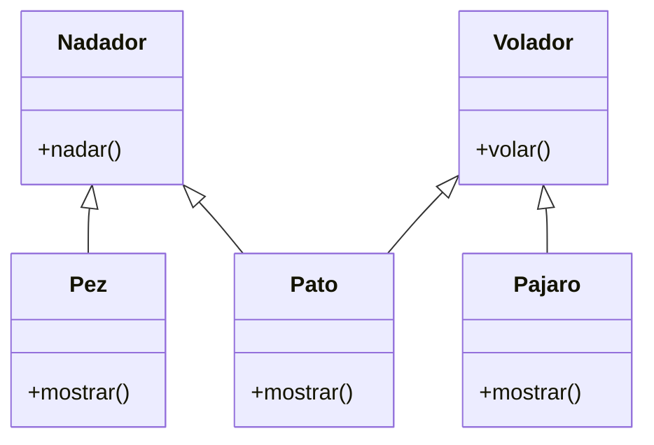

Debes desarrollar un videojuego tipo aventura, donde los personajes tiene distintas habilidades
Cada personaje pertenece a uno o más tipos que definen sus comportamientos:
Nadador: Puede ejecutar la acción nadar(), que representa la acción de desplazarse en el agua.
Volador: Puede ejecutar la acción volar(), que representa la acción de desplazarse por el aire.
En el juego existen tres personajes principales, cada uno con habilidades específicas:
Pez: tiene la habilidad de nadar.
Pájaro: tiene la habilidad de volar.
Pato: tiene ambas habilidades, puede nadar y volar.
Cada personaje debe contar con un método mostrar() que indique el tipo de personaje y su habilidad principal o combinada.

## Análisis
Requisitos:
- Existe dos habilidades nadar y volar.
- El Pez puede nadar.
- Pájaro puede volar.
- Pato puede nadar y volar.

Objetos:
- Nadador
- Volador
- Pez
- Pajaro
- Pato

Características:
- Nadador
  - nombre
- Volador
  - nombre
- Pez
  - nombre
- Pajaro
  - nombre
- Pato
  - nombre

Acciones:
- Nadador
 - nadar()
- Volador
 - volar() 
- Pez
 - mostrar()
- Pajaro
 - mostrar()
- Pato
 - mostrar() 

## Diseño:
Clases:
- Nadador:
  - Nombre: Nadador
  - Atributos:
    - nombre
  - Métodos:
    - nadar()
  
- Volador:
  - Nombre: Volador
  - Atributos:
    - nombre
  - Métodos:
    - volar()

- Pez:
  - Nombre: Pez
  - Atributos:
    - nombre
  - Métodos:
    - mostrar()

- Pajaro:
  - Nombre: Pajaro
  - Atributos:
    - nombre
  - Métodos:
    - mostrar()
- Pato:
  - Nombre: Pato
  - Atributos:
    - nombre
  - Métodos:
    - mostrar()
  

