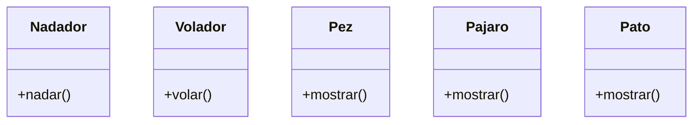

Debes desarrollar un videojuego tipo aventura, donde los personajes tiene distintas habilidades
Cada personaje pertenece a uno o más tipos que definen sus comportamientos:
Nadador: Puede ejecutar la acción nadar(), que representa la acción de desplazarse en el agua.
Volador: Puede ejecutar la acción volar(), que representa la acción de desplazarse por el aire.
En el juego existen tres personajes principales, cada uno con habilidades específicas:
Pez: tiene la habilidad de nadar.
Pájaro: tiene la habilidad de volar.
Pato: tiene ambas habilidades, puede nadar y volar.
Cada personaje debe contar con un método mostrar() que indique el tipo de personaje y su habilidad principal o combinada.

Requisitos:
- Desarrollar un videojuego tipo aventura.
- Pez nada.
- Pájaro vuela.
- Pato puede nadar y volar.

Objetos:
- Pez
- Pájaro
- Pato
- Nadador
- Volador
    
Acciones:
- Pez
 - mostrar 
- Pájaro
 - mostrar 
- Pato
 - mostrar 
- Nadador
 - Nada
- Volador
 - Vuela   
  

