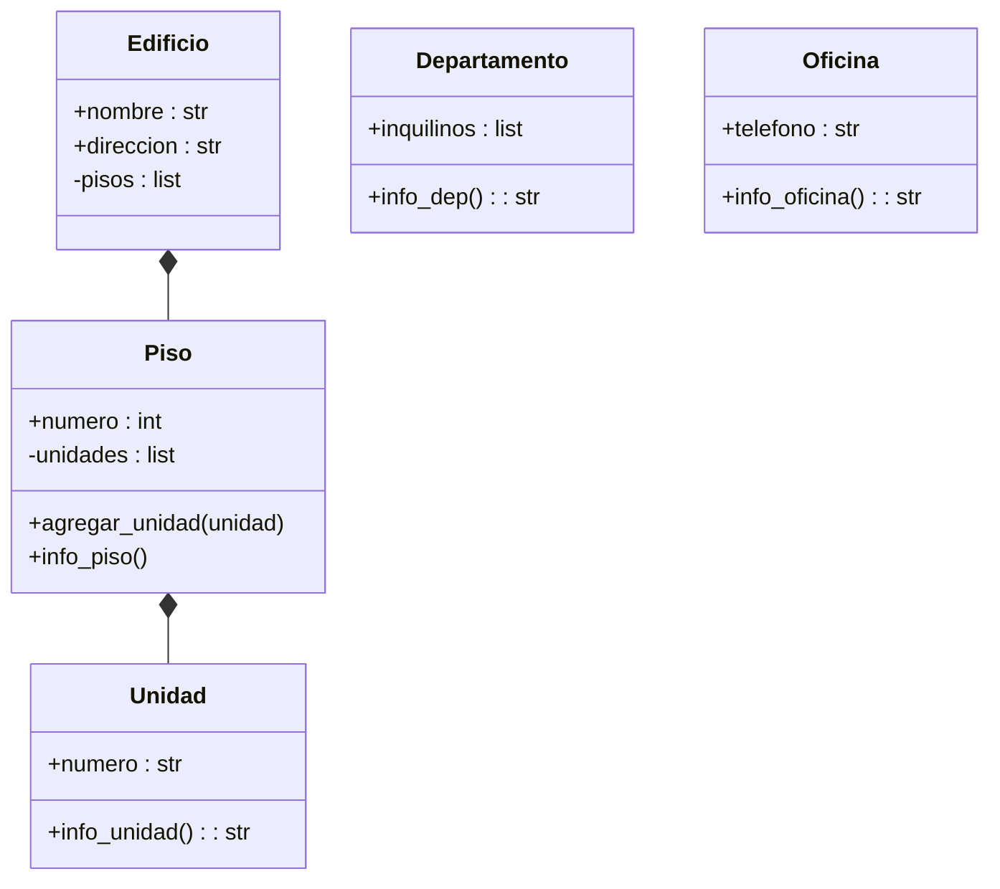

Se debe modelar un edificio ubicado en la ciudad de La Paz, compuesto por 3 pisos. Cada piso contiene una combinación de departamentos y oficinas
Cada departamento tiene un número que comienza con el número del piso seguido de un número de unidad (por ejemplo: 201, 304).
Cada oficina tiene un número que comienza con el número del piso seguido de una letra (por ejemplo: 2A, 3C).
Además:
El edificio tiene direccion y nombre.
Los pisos tienen un atributo numero
Las oficinas cuentan con un atributo telefono.
Los departamentos tienen un atributo inquilinos.
El sistema debe permitir:
Crear un edificio con sus pisos correspondientes.
Agregar departamentos y oficinas a cada piso.
Acceder y mostrar la información del edificio de forma organizada y jerárquica
Realiza el análisis y diagrama de clases de las clases Edificio, Piso, Dpartamento y Oficina en el archivo ejercicio_02.md.
Escribe el código en Python de las clases Edificio, Piso, Departamento y Oficina en el archivo ejercicio_02.py.
Implementa relaciones jerárquicas entre objetos:Un edificio contiene varios pisos.
Cada piso contiene varios departamentos y oficinas

Requisitos:
- Edificio está ubicado en La Paz y tiene 3 pisos.
- Los números de Departamento usan formato: PisoUnidad (201).
- Los números de Oficina usan formato: PisoLetra (2A).
- El sistema debe permitir crear la estructura, agregar unidades y mostrar la información jerárquicamente.

Objetos:
- Edificio
- Piso
- Unidad 
- Departamento 
- Oficina 

Caracteristicas:
- Edificio
  - nombre: String
  - direccion: String
  - pisos: List
- Piso
  - numero: int
  - unidades: List
- Unidad 
  - numero: string
- Departamento:
  - Inquilinos: List
- Oficina 
  - Telefono: String
    
Acciones:
- Edificio
  - agregar_piso()
  - info_edificio()
- Piso
  - agregar_unidad()
  - info_piso()
- Unidad 
  - info_unidad()
- Departamento:
  - info_dep()
- Oficina 
  - info_oficina()  
  

