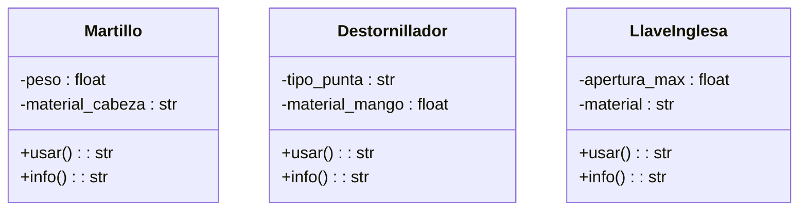

En un taller de carpintería, los trabajadores utilizan diferentes herramientas para construir muebles, reparar objetos o ajustar piezas.
Cada herramienta tiene una función específica, pero todas pueden ser utilizadas por el carpintero de manera similar.
Por ejemplo:
El martillo se usa para clavar clavos
El destornillador se usa para ajustar tornillos
La llave inglesa se usa para apretar tuercas
El carpintero no necesita saber el tipo exacto de herramienta que está utilizando, solo necesita que la herramienta pueda ejecutar la acción usar()

Requisitos:
- Taller de carpintería, los trabajadores utilizan diferentes herramientas.
- Herramientas Martillo, Destornillador y Llave Inglesa.
- Todas las herramientas deben tener un método usar().
- El método usar() debe contener la funcionalidad específica de cada herramienta.
- Se debe demostrar que un Carpintero puede interactuar con cualquier objeto que tenga el método usar().

Objetos:
- Martillo
- Destornillador
- Llave Inglesa
  
Características:
- Martillo:
 - peso: float
 - material: string 
- Destornillador:
 - Tipo de punta: string
 - material de mango: string
- Llave Inglesa
 - apertura: float
 - material: string 
  
Acciones:
- Martillo:
 - usar()
 - info() 
- Destornillador:
  - usar()
  - info() 
- Llave Inglesa
  - usar()
  - info() 
  

