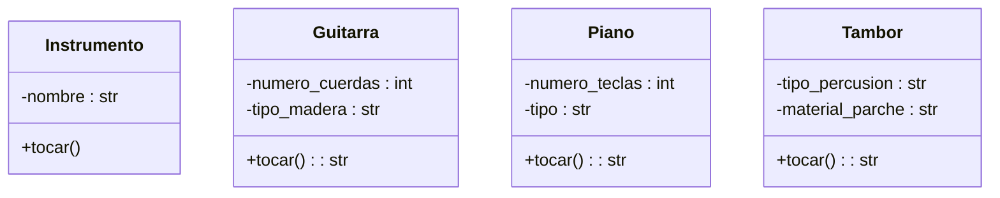

Una aplicación de aprendizaje musical permite a los usuarios practicar con distintos instrumentos Cada instrumento tiene una forma particular de producir sonido, pero todos pueden ser tocados por el usuario mediante una acción común.
Por ejemplo:
La guitarra hace "strum"
El piano hace "plin"
El tambor hace "boom"
Aunque cada instrumento suena distinto, todos comparten una característica común:
pueden ejecutar la acción tocar()

Requisitos:
- Aplicación de aprendizaje musical.
- Los usuarios practican con distintos instrumentos.
- Cada instrumento tiene una forma particular de producir sonido
- Todos los instrumentos pueden ser tocados por el usuario

Objetos:
- Instrumento
  - nombre: string
- Guitarra:
 - número de cuerdas: int
 - tipo de madera: string
- Piano
 - numero de teclas: int
 - tipo: string
- Tambor:
 - tipo de percusion: string
 - material: string
    
Acciones:
- Instrumento 
 - tocar() 
- Guitarra
 - info() 
- Piano
 - info()  
- Tambor 
 - info()  
  

