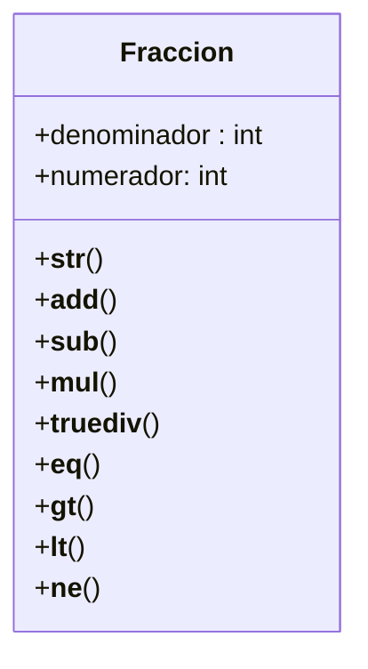

Un profesor de matemáticas necesita una calculadora de fracciones para enseñar conceptos básicos de aritmética. Cada fracción se representa mediante un numerador y un denominador.
Por ejemplo, la fracción 3/4 tiene un numerador igual a 3 y un denominador igual a 4.
Crea la clase Fraccion que permita representar y operar con fracciones de forma intuitiva utilizando métodos especiales (dunder methods) y cumpla con los siguientes:

Representación: "numerador/denominador"
Puede sumar con otra fracción, operador: +
Puede restar con otra fracción, operador: -
Puede multiplicar con otra fracción, operador: *
Puede dividir con otra fracción, operador: /

Además, la clase Fraccion debe permitir comparar:

Con otra fracción para igualdad, operador: ==
Con otra fracción para menor que, operador: <
Con otra fracción para mayor que, operador: >
Con otra fracción para desigualdad, operador: !=

# Análisis
Requisitos:
- La fracción debe tener dos atributos: numerador y denominador.
- La fracción debe poder representarse como "numerador/denominador"
- Se debe poder sumar fracciones.
- Se debe poder restar fracciones.
- Se debe poder dividir fracciones.
- Se debe poder multiplicar fracciones.
- Se debe poder comparar igualdad entre fracciones.
- Se debe poder comparar mayor que entre fracciones.
- Se debe poder comparar menor que entre fracciones.
- Se debe poder comparar desigualdad entre fracciones.

Objetos:
- Fraccion
  
Características:
- Fraccion: numerador, denominador 
   
Acciones:
- Fraccion: representación, suma, resta, división, multiplicación, igualdad, mayor que, menor que, desigualdad.
  

