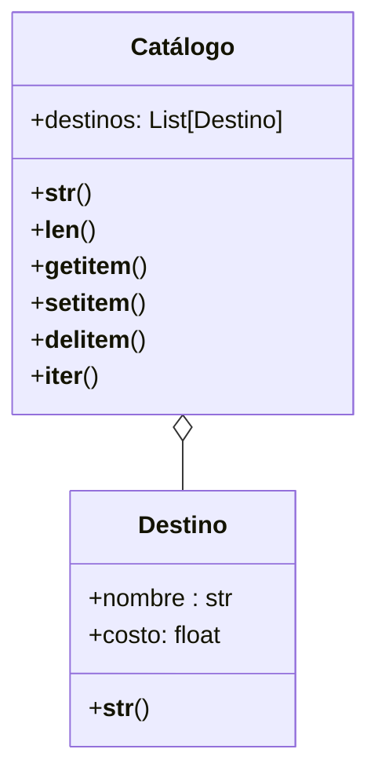

Una agencia de viajes gestiona un catálogo digital que contiene información sobre destinos turísticos. Cada destino tiene un nombre y un costo asociado, y la agencia desea que el catálogo permita visualizar, modificar y recorrer los destinos de forma intuitiva.
Los Destinos se representan como: "[destino] ➡ [costo] USD"
El Catálogo de Destinos se representa como:
🗺 Destinos 🗺
1. destino1
2. destino2
...
n. destinoN
El catálogo debe permitir:
Ver la longitud del catálogo, len(catalogo)
Acceder por su índice, catalogo[indice]
Agregar destinos, catalogo[indice]=destino
Eliminar destinos, del catalogo[indice]
Iterar sobre los destinos, for destino in catalogo
Ver el catálogo en el formato especificado
Ver un destino en el formato especificado

# Análisis
Requisitos:
- Catálogo contiene una colección de destinos.
- Cada destino debe tener dos atributos: nombre y costo.
- Los destinos deben representarse como: "[destino] ➡ [costo] USD".
- El catálogo debe representarse como:
  🗺 Destinos 🗺
  1. destino1
  2. destino2
  ...
  n. destinoN
- Se debe poder ver la longitud del catálogo.
- Se debe poder acceder por índice a un destino.
- Se debe poder agregar destinos.
- Se debe poder eliminar destinos.
- Se debe poder iterar sobre los destinos.
- Se debe poder ver el catálogo en el formato especificado.
- Se debe poder ver un destino en el formato especificado.

Objetos:
- Catálogo
- Destino
  
Características:
- Catálogo: colección de destinos.
- Destino: nombre, costo. 
   
Acciones:
- Catálogo: representación, longitud.
- Catálogo: acceso por índice, asignación por índice, eliminación por índice, iteración.
- Destino: representación.
  

