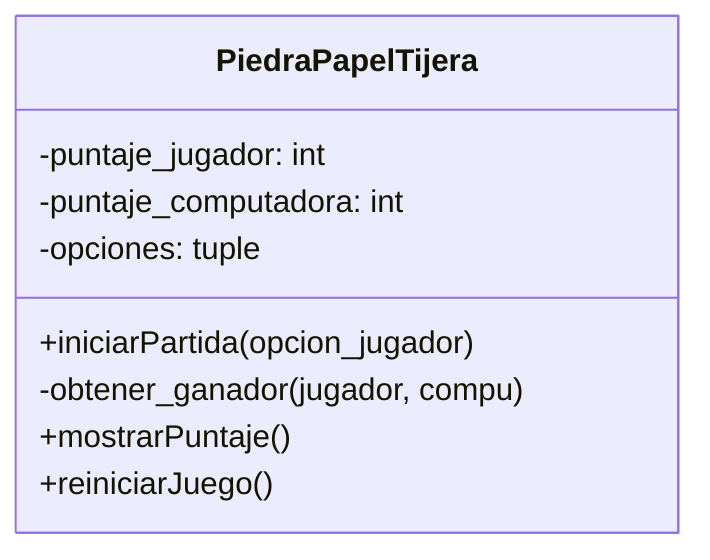

Crea el juego Piedra, Papel o Tijera implementando el patrón de diseño Singleton En esta versión, un jugador compite contra la computadora, la cual selecciona aleatoriamente entre las tres opciones disponibles:
Piedra , Papel , Tijera
Se debe registrar las partidas ganadas tanto por el jugador como por la computadora, manteniendo el control del puntaje dentro de la única instancia del juego.
Implementa la clase PiedraPapelTijera aplicando el patrón de diseño Singleton, asegurando que exista una única instancia del juego durante toda la ejecución.
La clase debe incluir los siguientes métodos:
iniciarPartida(): Permite jugar una ronda contra la computadora
mostrarPuntaje(): Muestra el puntaje acumulado del jugador y de la computadora.
reiniciarJuego(): Restablece los puntajes a cero.
Además, se debe implementar un menú interactivo en consola con las siguientes opciones:
1. Iniciar una nueva partida
2. Mostrar puntajes
3. Reiniciar el juego
4. Salir

# Análisis
Requisitos:
- El juego es Piedra, papel o tijera.
- Compiten el jugador contra la computadora.
- La computadora elije aleatoriamente entre las 3 opciones (Piedra, papel o tijera).
- El juego registra el puntaje del jugador en una única instancia.
- El juego registra el puntaje de la computadora en una única instancia.
- El juego tiene un menú interactivo con 4 opciones (Iniciar una nueva partida, Mostrar puntajes, Reiniciar el juego, Salir)

Objetos:
- PiedraPapelTijera: Representa el juego en sí.

Características:
- PiedraPapelTijera: score_jugador, score_computadora, opciones.

Acciones:
- PiedraPapelTijera: iniciarPartida(opcion_jugador), reinicia, muestra score.
  

