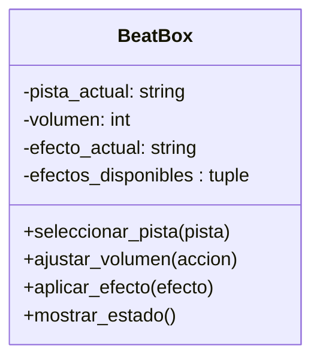

Un DJ requiere una nueva consola de mezcla llamada BeatBox, capaz de mezclar pistas de audio en tiempo real.
La consola debe permitir:
Seleccionar una pista de audio
Ajustar el volumen (subir o bajar)
Mostrar el estado actual de la consola (pista seleccionada y nivel de volumen)
Aplicar un único efecto de sonido a la vez, entre las opciones: eco, reverb o distorsión
Crea la clase BeatBox implementando el patrón de diseño Singleton La clase debe incluir los siguientes métodos:
seleccionar_pista() → Permite elegir una pista de audio.
ajustar_volumen() → Permite subir o bajar el volumen.
aplicar_efecto() → Aplica un efecto de sonido (eco, reverb o distorsión).
mostrar_estado() → Muestra el estado actual de la consola (pista seleccionada y nivel de volumen).
El programa debe ofrecer un menú con las siguientes opciones:
1. Ingresar el nombre de la pista de audio
2. Ajustar volumen
3. Aplicar efecto de sonido
4. Mostrar estado actual
5. Salir

# Análisis
Requisitos:
- Simular una consola de mezcla BeatBox.
- La consola añade una pista de audio.
- La consola ajusta el volumen.
- La consola muestra su estado actual (pista y volumen).
- La consola muestra efectos de sonido, uno a la vez.

Objetos:
- BeatBox: Representa el juego en sí.

Características:
- BeatBox: pista_actual, volumen, efecto_actual.

Acciones:
- BeatBox: seleccionar_pista, ajustar_volumen, aplicar_efecto, mostrar_estado.
  

