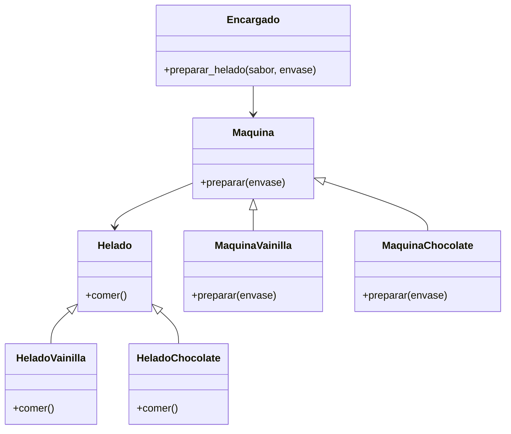

En una heladería, los clientes pueden pedir helados de vainilla o chocolate.
Además, pueden elegir si desean su helado en cono o en vaso.
El encargado utiliza la máquina adecuada para preparar cada sabor:
La máquina de vainilla solo prepara helados de vainilla.
La máquina de chocolate solo prepara helados de chocolate.
Todos los helados comparten características en común:
Se pueden comer.
Tienen un envase (cono o vaso).
El sistema debe permitir al usuario realizar pedidos de helado mediante un Factory, y escribir "salir" para terminar el proceso.
Los helados se representan como:
"[sabor] 🍦 en [envase]"
El menú de opciones se representa como:
🍨 Pedidos de Helado 🍨
1. Vainilla en Cono
2. Vainilla en Vaso
3. Chocolate en Cono
4. Chocolate en Vaso
Escribe "salir" para terminar.
El sistema debe permitir:
Crear helados mediante una fábrica
Representar cada helado en el formato especificado.
Registrar varios pedidos hasta que el usuario escriba "salir".

# Análisis
Requisitos:
- Se preparan dos clases de helados: Vainilla y Chocolate.
- El cliente elige si el helado es en cono o vaso.
- Se utiliza la máquina adecuada para preparar cada sabor.
- Todos los helados se pueden comer y tienen envase.
- El sistema debe permitir pedidos mediante un Factory, y "salir" termina el proceso.
- Los helados se representan como: "[sabor] 🍦 en [envase].

Objetos:
- Helado (Vainilla, Chocolate)
- Maquina (MaquinaVainilla, MaquinaChocolate)
- Encargado

Características:
- Helado: (sin características)
- HeladoVainilla: (Helado)
- HeladoChocolate: (Helado)
- Maquina: (sin características)
- MaquinaVainilla: (Maquina)
- MaquinaChocolate: (Maquina)
- Encargado: (sin características)

Acciones:
- Helado: comer
- HeladoVainilla: comer
- HeladoChocolate: comer
- Maquina: preparar
- MaquinaVainilla: preparar
- MaquinaChocolate: preparar
- Encargado: preparar helado
  
# Diseño:
- Helado:
    - Nombre: Helado
    - Métodos:
      - comer()

- HeladoVainilla:
    - Nombre: HeladoVainilla
    - Métodos:
      - comer()

- HeladoChocolate:
    - Nombre: HeladoChocolate
    - Métodos:
      - comer()

- Maquina:
    - Nombre: Maquina
    - Métodos:
      - preparar()
  
- MaquinaVainilla:
    - Nombre: MaquinaVainilla
    - Métodos:
      - preparar(envase)

- MaquinaChocolate:
    - Nombre: MaquinaChocolate
    - Métodos:
      - preparar(envase)

- Encargado:
    - Nombre: Encargado
    - Métodos:
      - preparar_helado(sabor, envase)

