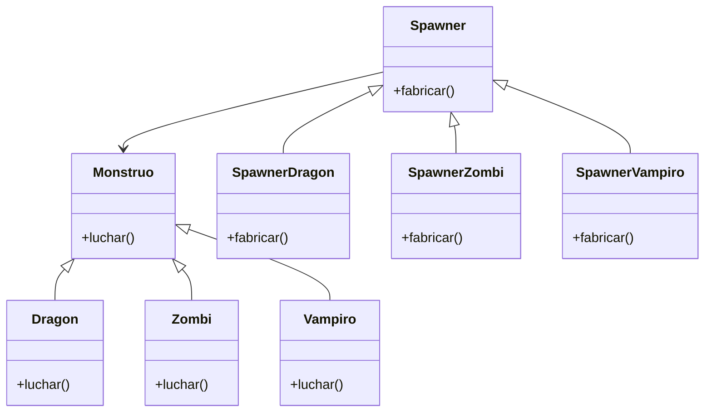

Simulador de Batalla de Monstruos

Dos jugadores pueden elegir un monstruo para luchar.
Cada jugador selecciona uno de los siguientes tipos:
Dragón
Zombi
Vampiro

Cada monstruo tiene fortalezas y debilidades:
- Dragón:
  - Fuerte contra Zombi
  - Débil contra Vampiro
  - Igual contra Dragón
- Zombi:
  - Fuerte contra Vampiro
  - Débil contra Dragón
  - Igual contra Zombi
- Vampiro:
  - Fuerte contra Dragón
  - Débil contra Zombi
  - Igual contra Vampiro
El simulador debe determinar el resultado de la batalla entre los monstruos elegidos, si alguno de los jugadores escribe "salir", el juego termina.
Los monstruos se representan como:
"[monstruo] 🧟‍♂️ listo para luchar"
El menú de selección se representa como:

🧩 Selección de Monstruos 🧩
Jugador 1: Elige tu monstruo (dragón/zombi/vampiro):
Jugador 2: Elige tu monstruo (dragón/zombi/vampiro):
Escribe "salir" para terminar.
El sistema debe permitir:
Crear monstruos mediante una fábrica
Representar cada monstruo en el formato especificado.
Determinar el resultado de la batalla según las fortalezas y debilidades.
Registrar varias batallas hasta que un jugador escriba "salir".

# Análisis
Requisitos:
- Cada jugador elige un mounstruo entre Dragón, Zombi, Vampiro.
- La batalla se determina por las fortalezas y debilidade.
- Dragón: Fuerte contra Zombi, Débil contra Vampiro, Igual contra Dragón.
- Zombi:Fuerte contra Vampiro, Débil contra Dragón, Igual contra Zombi.
- Vampiro: Fuerte contra Dragón, Débil contra Zombi, Igual contra Vampiro.
- Se debe determinar el resultado de la batalla.
- El juego se termina cuando un jugador escribe salir.
- Los monstruos deben representarse como: "[monstruo] 🧟‍♂️ listo para luchar"

Objetos:
- Mounstro(Dragon, zombi, vampiro)
- Spawner (SpawnerDragon, SpawnerZombi, SpawnerVampiro)

Características:
- Mounstro: (sin características)
- Dragon,: (Mounstro)
- Zombi: (Mounstro)
- Vampiro: (Mounstro)
- Spawner: (sin características)
- SpawnerDragon: (Spawner)
- SpawnerZombi: (Spawner)
- SpawnerVampiro: (Spawner)

Acciones:
- Mounstro: (sin características)
- Dragon: (Mounstro)
- Zombi: (Mounstro)
- Vampiro: (Mounstro)
- Spawner: (sin características)
- SpawnerDragon: (Spawner)
- SpawnerZombi: (Spawner)
- SpawnerVampiro: (Spawner)
  
# Diseño:
- Mounstro:
    - Nombre: Mounstro
    - Métodos:
      - luchar()

- Dragon:
    - Nombre: Dragon
    - Métodos:
      - luchar()

- Zombi:
    - Nombre: Zombi
    - Métodos:
      - luchar()

- Vampiro:
    - Nombre: Vampiro
    - Métodos:
      - luchar()
  
- Spawner:
    - Nombre: Spawner
    - Métodos:
      - fabricar()
  
- SpawnerDragon:
    - Nombre: SpawnerDragon
    - Métodos:
      - fabricar()

- SpawnerZombi:
    - Nombre: SpawnerZombi
    - Métodos:
      - fabricar() 

- SpawnerVampiro:
    - Nombre: SpawnerVampiro
    - Métodos:
      - fabricar() 

