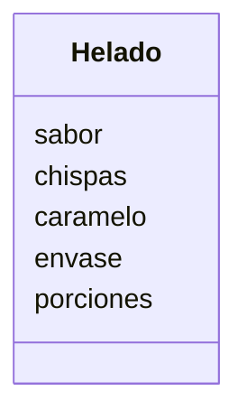

Una heladería ofrece helados
Los clientes eligen entre helado de vainilla o fresa
Pueden agregar chispas de chocolate y caramelo líquido como extra
Puede llevarse en barquillo o vaso y tener hasta 3 bolitas

# Analisis

Requisitos:
- helados de vainilla o fresa
- Extras de chocolate y caramelo líquido
- Barquillo o vaso
- Tener hasta 3 bolitas

Objetos:
- Helado

Características:
- Helado
    - sabor
    - chispas
    - caramelo
    - envase
    - porciones

Acciones:
- (No hay acciones)

# Diseño:

Clases:
- Helado:
    - Nombre: Helado
    - Atributos:
        - sabor
        - chispas
        - caramelo
        - envase
        - porciones
    - Métodos:
        - (No hay métodos)
        - 

