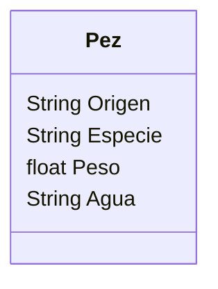

Requisitos:
- Registrar peces
- Registrar los atributos de cada pez
- Actualizar su peso antes de liberarlos
- Liberar los peces
Objetos:
- Pez
Características:
- Pez
    - Origen
    - Especie
    - Peso
    - Agua

Acciones:
- (No hay acciones)

