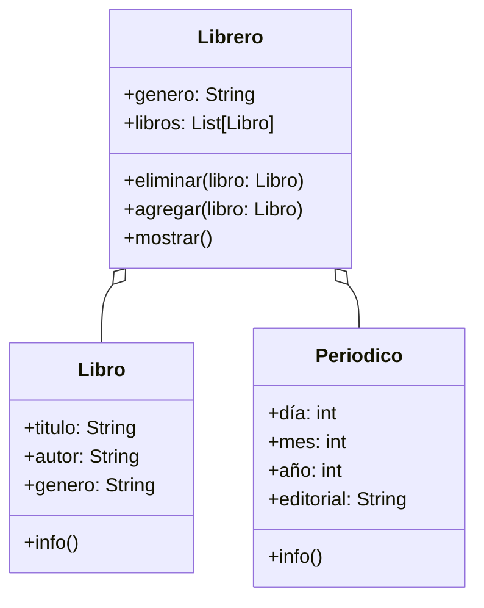

Una biblioteca guarda en un sistema el título, autor y género
de sus libros. Existen libreros digitales para organizar
Los libros están organizados por género, y se puede
agregar o eliminar libros de cada librero.
Se puede mostrar todos los libros de un librero
Actualmente existen 2 géneros: 
- Cocina
- Arte
Los libros de cada uno de estos géneros
son:
- Cocina
  - Cocina Criolla Boliviana, Daniel Figliuzzi
  - Gran libro cocina Boliviana, Jaime Cisneros
- Arte
  - Arte textil y mundo andino, Teresa Gisbert
  - Arte contemporáneo en Bolivia, Galería Altamira

# Análisis
Requisitos:
- Guardar información de libros (título, autor, género)
- Organizar libros por género en libreros
- Mostrar libros de cada librero 
- Mostrar la información de un libro
- Guardar info de periódico (día, mes, año, editorial)
- Mostrar todos los periodicos
Objetos:
- Libro
- Librero
- Periódico
Características:
- Libro:
    - título: String
    - autor: String
    - género: String
- Librero:
  - género: String
  - libros: List[Libro]
  - periodicos: List[Periodicos]
- Periódico:
  - día: int
  - mes: int
  - año: int
  - editorial: String
Acciones:
- Libro:
  - info()
- Librero:
  - agregar_libro(libro)
  - eliminar_libro(libro)
  - mostrar_libro()
  - mostrar_periodico()
  - agregar_periodico(periodico)
  - eliminar_periodico(periodico)
- Periodico
  - info () 
